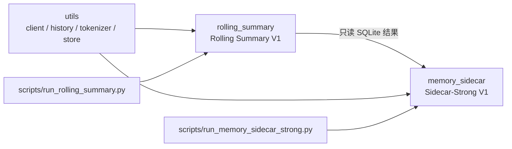
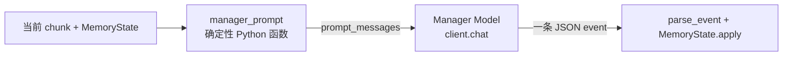
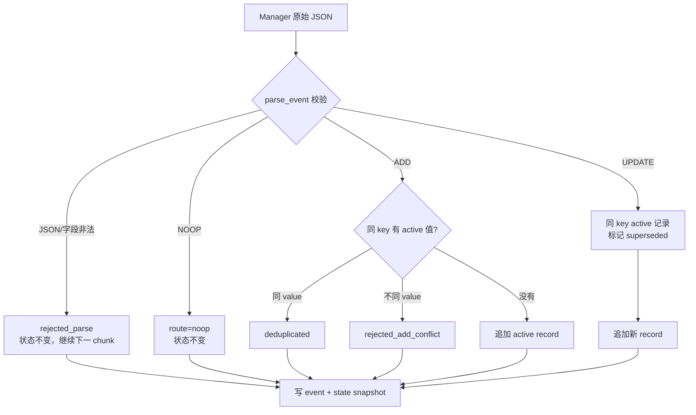
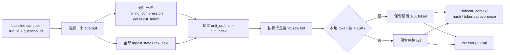
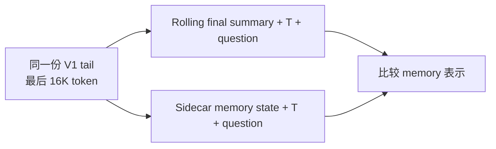
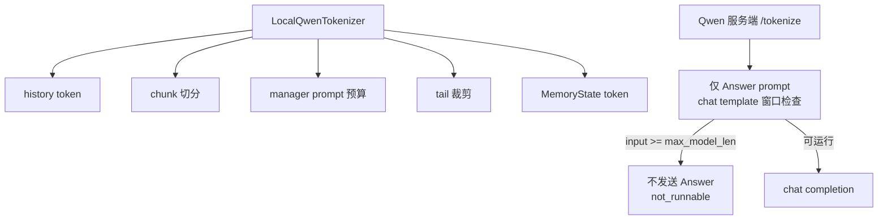
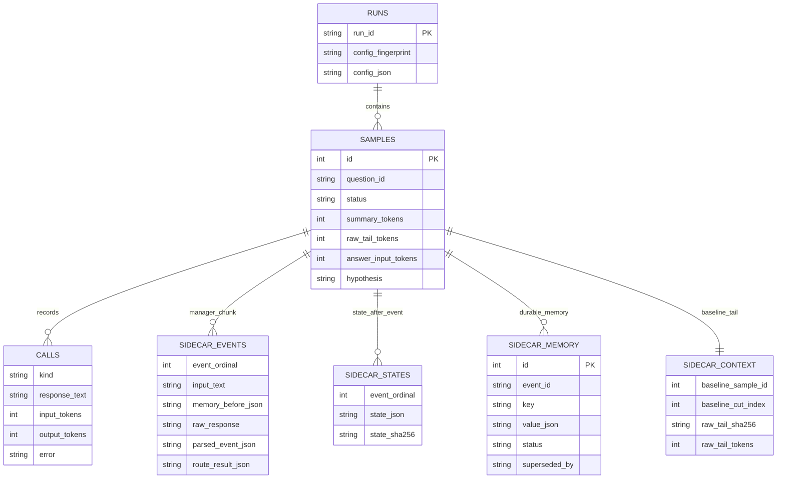
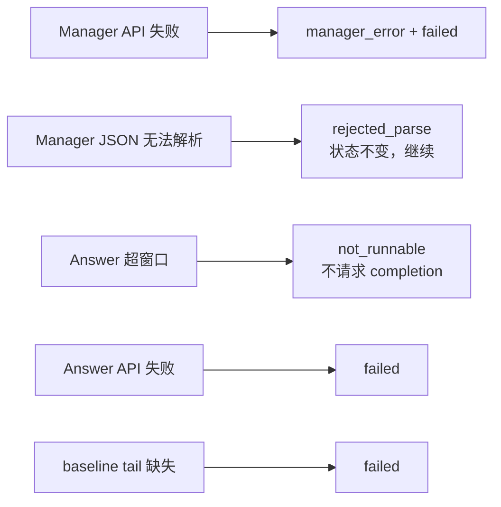

# Memory Sidecar Strong V1 实施记录

本文是代码导读，不记录准确率结论。研究假设、pilot 门槛和 Sidecar-Small 路线见 [Memory Sidecar 方案一：快速可行性验证计划](2026-08-22_memory_sidecar_pilot_v1.md)。

## 1. 项目边界



`memory_sidecar/` 不导入 `rolling_summary.*`。它对 V1 的唯一依赖是读取 `--baseline-db` 中已完成样本的 tail；模型客户端、历史规范化、本地 tokenizer 和 SQLite 轨迹库都来自 `utils/`。

入口是 `scripts/run_memory_sidecar_strong.py`。默认使用清洗后 LongMemEval-S、Qwen 3.8-27B、`chunk=2048`、`manager context=12288`、`recent tail=16384`、`manager output=768`、`answer output=1024` 和单并发。

## 2. 单样本程序流程

对应 `memory_sidecar.process.process_one()`：

```mermaid
flowchart TD
    A[源样本 row] --> B[chronological_sessions<br/>build_message_stream]
    B --> C[LocalQwenTokenizer<br/>按完整 user-assistant turn 分 chunk]
    D[旧 V1 trajectory.sqlite3] --> E[load_baseline_tail]
    E --> F[recent raw tail<br/>最多 16K token]
    C --> G{逐个 chunk}
    H[MemoryState] --> I[manager_prompt<br/>有界 active + update ledger]
    G --> I
    I --> J[Manager Model]
    J --> K[parse_event]
    K --> L[MemoryState.apply<br/>规则路由]
    L --> H
    L --> M[sidecar_events<br/>sidecar_states]
    L --> X[sync_sidecar_memory<br/>写入 sample 记忆库]
    G -->|下一个 chunk| I
    X --> N[load_sidecar_memory(sample_id)<br/>从数据库恢复完整 state]
    F --> O[answer_messages]
    N --> O
    O --> P[服务端 tokenize_messages<br/>最终窗口检查]
    P -->|可运行| Q[Answer Model]
    P -->|超窗口| R[not_runnable]
    Q --> S[samples.hypothesis<br/>calls / run_summary]
```

Manager 在单个样本内必须串行，因为下一 chunk 看到的是上一次事件路由后的 `MemoryState`。不同样本可由 `--max-concurrency` 并行，且各自持有 client、SQLite 连接和本地 tokenizer encoder。

chunk 的最小不可拆分单位是同一 session 中连续的一个 `user -> assistant` turn。`chunks()` 将多个完整 turn 连续累积，候选文本超过 `--chunk-budget-tokens`（默认 2048）时才切分。历史开头的 assistant、session 末尾未配对的 user、或异常 role 顺序会保留为单条 unit；不会跨 session 配对。一个 chunk 可以包含多个完整 turn，但不会把某个完整 `user -> assistant` 拆到两个 chunk。

图中的两个相邻节点职责不同：



- `manager_prompt()` 位于 `memory_sidecar.budget`：从当前 state 取有界的 active records 和 update ledger，加上当前 chunk，按本地 token 预算构造 prompt。它返回 `memory_before`、`prompt_messages` 和 `prompt_tokens`；不调用模型，也不改变状态。
- Manager Model 位于 `memory_sidecar.process._run_manager_chunk()`：执行 `client.chat(prompt_messages)`，只输出一条 `ADD`、`UPDATE` 或 `NOOP` JSON event，不回答最终问题。
- `parse_event()` 与 `MemoryState.apply()` 再用规则校验并路由该 event。Manager 和 Answer 在 V1 可以配置为同一模型服务，但前者负责写记忆，后者负责回答问题。

### 示例：当前 chunk 更新已有额度

当前 `MemoryState` 已有一条 active 记录，当前 chunk 是历史流中的一个完整 turn：

当前 active record：

```json
{"key":"mortgage.preapproval","value":"$350,000","status":"active"}
```

当前 chunk，source unit 为 `[42, 43]`：

```text
User: The bank raised my mortgage preapproval to $400,000.
Assistant: That is a higher preapproval amount.
```

`manager_prompt()` 不做判断，只把两部分组织为 prompt：

```text
# Current active memory plus recent update ledger
{"active_records":[{"key":"mortgage.preapproval","value":"$350,000","status":"active"}],"update_ledger":[]}

# Current chunk, source units [42, 43]
User: The bank raised my mortgage preapproval to $400,000.
Assistant: That is a higher preapproval amount.
```

Manager Model 读取这个 prompt，生成一条事件：

```json
{
  "action": "UPDATE",
  "memory_type": "fact",
  "key": "mortgage.preapproval",
  "value": "$400,000",
  "status": "active",
  "source": {"session_id": "s2", "message_indices": [42]},
  "confidence": 0.98
}
```

之后 `MemoryState.apply()` 才执行替换：旧 `$350,000` 标为 `superseded`，新 `$400,000` 追加为 active。也就是说，`manager_prompt()` 负责**把证据交给模型**，Manager Model 负责**提出事件**，规则代码负责**真正修改状态**。

## 3. Manager 事件如何变成记忆

对应 `memory_sidecar.protocol.parse_event()` 和 `MemoryState.apply()`：



本节记录的是当时的 V1 实现，不代表下一版修复方案。V1 对同 key 的不同 value `ADD` 直接返回 `rejected_add_conflict`，不会自动判断“补充”还是“替换”；旧值继续保持 active，新候选只保存在 `sidecar_events` 的原始事件和路由结果中。因此，V1 会出现事实已经在 manager 输入中、但没有进入最终 `sidecar_memory` 的情况。

该缺陷及新的 `merge/UPDATE/conflict_pending` 路由方案单独记录在：[Memory Sidecar Memory Conflict 修复方案](2026-08-23_memory_sidecar_memory_conflict_resolution_v1.md)。

### 示例：贷款额度被新值替换

假设清洗后的历史流中有两个 chunk：

```text
chunk A，source unit [17]
User: My mortgage preapproval is $350,000.

chunk B，source unit [42]
User: The bank raised my mortgage preapproval to $400,000.
```

Manager 对 chunk A 输出 `ADD`：

```json
{
  "action": "ADD",
  "memory_type": "fact",
  "key": "mortgage.preapproval",
  "value": "$350,000",
  "status": "active",
  "event_date": null,
  "source": {"session_id": "s1", "message_indices": [17]},
  "confidence": 0.98
}
```

`MemoryState.apply()` 追加 `event-1`。随后 chunk B 的 Manager 不能再输出不同值的 `ADD`，而应输出：

```json
{
  "action": "UPDATE",
  "memory_type": "fact",
  "key": "mortgage.preapproval",
  "value": "$400,000",
  "status": "active",
  "event_date": null,
  "source": {"session_id": "s2", "message_indices": [42]},
  "confidence": 0.98
}
```

路由后的追加式状态是：

```json
{
  "records": [
    {
      "event_id": "event-1",
      "key": "mortgage.preapproval",
      "value": "$350,000",
      "status": "superseded",
      "superseded_by": "event-2",
      "source_unit_ordinals": [17]
    },
    {
      "event_id": "event-2",
      "key": "mortgage.preapproval",
      "value": "$400,000",
      "status": "active",
      "source_unit_ordinals": [42]
    }
  ]
}
```

因此 Manager 的下一轮有界视图会看到 active 的 `$400,000` 和旧值账本；Answer Model 会同时看到两个版本，并按 `status` 使用 `$400,000`。若 chunk B 错误输出 `ADD`，路由结果是 `rejected_add_conflict`，状态保持为旧的 `$350,000`，该错误会写入 `sidecar_events.route_result_json`。

## 4. recent tail 从哪里来

对应 `memory_sidecar.data.load_baseline_tail()`：



`states.raw_text` 是 V1 在 ingest 时保存的 canonical 单消息文本，因此重建前使用同一 renderer。最后的 16K 裁剪按 token 进行，**可能从一条消息中间开始**；`sidecar_context` 只保存 hash、token 数和 source ordinals，不复制 tail 正文。

当前的“固定 16K”只在 Sidecar 中生效：`--recent-tail-budget-tokens` 与 `MemoryState` 大小无关，记忆变长不会挤占 tail。旧 `rolling-summary-eval120-v1-atomic-c2` 的 Answer 没有独立 16K tail 上限，因此当前 Sidecar 结果不能直接和其历史结果做严格单变量比较。

要做严格对照，应使用同一份 tail snapshot 重跑 Answer：



## 5. token 计数与窗口检查



本地 tokenizer 是预处理预算的唯一计数器。服务端 `/tokenize` 只在最终 Answer 前调用一次，因为它包含实际 chat template；成功请求的 input/output token 以服务端 usage 为准。

`samples.summary_tokens` 当前复用为 `MemoryState` token 数，`samples.raw_tail_tokens` 记录 tail，`samples.answer_input_tokens` 记录最终 Answer 输入。字段名 `summary_tokens` 对 Sidecar 不够准确，但当前 schema 未新增 `memory_tokens` 列。

## 6. SQLite 轨迹



- `sidecar_events` 回答“Manager 看到了什么、输出了什么、规则如何处理”。其中 `route_result_json.manager_prompt_tokens` 保存本地 manager prompt 计数。
- `sidecar_states` 保存每个事件后的完整状态快照，便于回放；代价是状态越长，SQLite 增长越快。
- `sidecar_context` 不保存 raw tail 正文，正文仍可从 baseline `states.raw_text` 重建。
- `sidecar_memory` 是每个 sample 独立的长期记忆库；prompt 可以滑动裁剪，但这里保留完整 key/value 和 superseded 关系。
- `calls` 保存模型返回文本和实际 usage；不保存完整请求 prompt 与 request params。

`sync_sidecar_memory()` 每次路由后按 `event_id` upsert 完整 `MemoryState.records`：新增事实写入一行，`UPDATE` 导致的旧记录状态变化同步为 `superseded`。因此 prompt 的滑动窗口只减少模型可见上下文，不会删除记忆库中的事实；后续即使 Manager 看不到旧 key，规则层仍可依据同一 `sample_id` 的完整状态做去重和冲突识别。

`sidecar_memory` 是按 key 查询和恢复用的持久化事实源，`sidecar_states` 是按事件生成的完整快照；前者保证记忆不因窗口裁剪丢失，后者保证状态演进可审计。最终 Answer 阶段调用 `load_sidecar_memory(sample_id)` 恢复完整 records，再由 `MemoryState.render_for_answer()` 投影为紧凑事实，不直接把数据库字段原样放进 prompt。

最终 Answer 的实际输入关系是：

```text
sidecar_memory(sample_id)  ->  完整 memory records -> compact prompt facts
baseline states.raw_text   ->  bounded recent raw tail
row.question_date/question ->  当前日期和最终问题
三者                     ->  answer_messages() -> Answer Model
```

## 7. 失败与当前验证



`--debug-max-chunks` 会在 N 个 Manager chunk 后提前回答，只用于检查事件和路由。当前验证为 `pytest -q` 的 68 项测试、Python 编译检查、`git diff --check` 和两个 CLI `--help`；尚未由本文宣称任何真实模型 accuracy 结论。

当前实现将原计划中的 JSONL/state 文件改为 SQLite 的 `sidecar_events + sidecar_states + sidecar_memory`，避免每个样本生成大量小文件，同时保留事件、路由、长期记忆和状态快照。
