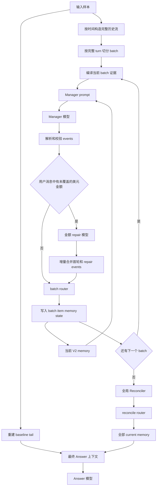
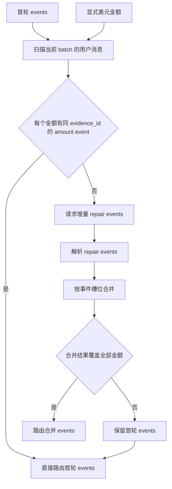
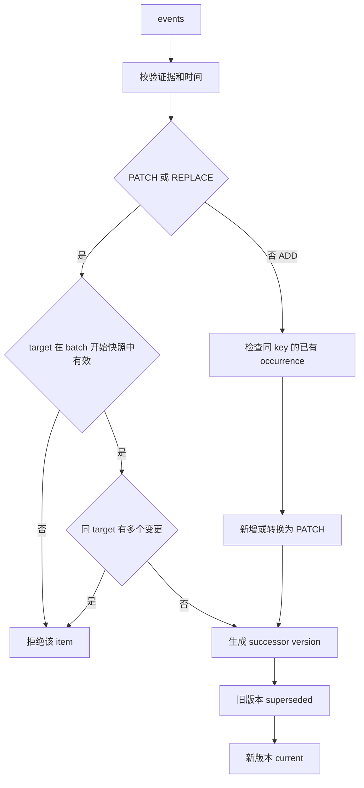

# Memory Sidecar V2 单样本处理流程

本文说明 [`process_one_v2()`](../../memory_sidecar/process_v2.py) 当前的实际执行逻辑。它处理一个 question_id：从完整历史中抽取版本化记忆，处理金额漏抽，最终使用 current memory 和近期原文回答问题。

## 总览



## 1. 历史、tail 与 batch

程序从基线数据库重建 `raw_tail`，但它**不参与 Manager 抽取**。Manager 始终从当前样本的完整历史流抽取记忆；tail 只在最后 Answer 时作为近期原文上下文。

完整历史按时间排序后，以完整 `user -> assistant` turn 为不可拆分单位切分 batch。V2 runner 默认每个 batch 目标为 `8192` tokens；某个 turn 自身超长时仍保持完整，允许超过此预算。batch 必须顺序处理，因为前一个 batch 写入的 current memory 是后一个 batch 的 PATCH 候选。

## 2. Manager 抽取

每个 batch 会生成两类输入：

- 当前 batch 的证据文本，例如 `[e0][user] ...`；`e0` 等只是本 batch 内的局部编号。
- 当前 memory 的 Manager 投影：最多最近 256 条 `lifecycle=current` 记录，包含 `record_ref`、类型、key、语义状态、attributes 与标准化时间。

Manager 返回未受信任的 `{"events":[...]}`。`parse_manager_response()` 先校验 JSON 结构、操作类型、证据编号、时间字段与 PATCH/REPLACE 的 `target_ref`。每个坏 item 独立标记 `_error`，不阻断同数组中的其他 item。

## 3. 金额漏抽与定向 repair



`uncovered_usd_amounts()` 只扫描当前 batch 中 `role=user` 的 `$5`、`$25`、`$120` 这类金额。assistant 的表格或回答经常重复用户刚说过的金额；这些重复文本不代表新事实，也不会触发 repair。

一个金额被覆盖需要同时满足：

1. 某个合法 event 的 `attributes.amount` 等于该金额。
2. 该 event 的 `evidence_ids` 包含金额所在的局部 `evidence_id`。

若不满足，程序调用一次金额 repair。repair prompt 会给出漏掉的具体证据，例如 `e40 contains $5`，并要求只返回补充该金额所需的 ADD、PATCH 或 REPLACE event，而不是重做整个 batch。

### 3.1 增量合并规则

repair 返回后，`merge_money_repair_events()` 将其并入首轮 events：

| repair 类型 | 对齐方式 | 合并行为 |
| --- | --- | --- |
| PATCH 或 REPLACE | `target_ref` | 替换首轮中同 target 的事件。 |
| ADD | `record_type + key + semantic_status + time_expression + time_evidence_id` | 替换首轮中同一新增事实的 ADD；没有同槽位时追加。 |

替换不是简单丢弃首轮 event：首轮已有的 attributes、证据与时间会保留，repair 显式给出的属性覆盖同名字段。因此首轮已经抽到 `item`、`location`，repair 仅补 `amount`、`currency` 时，最终 event 会含有这四个字段。

例子：

```text
首轮 PATCH r-2-0: item=helmet, location=downtown
repair PATCH r-2-0: amount=120, currency=USD
合并结果: item=helmet, location=downtown, amount=120, currency=USD
```

首轮 ADD 还没有进入 router，因此没有 `record_ref` 可供 repair 引用。修复首轮 ADD 时，模型应返回相同 key 的 ADD。若模型误返回无 `target_ref` 的 REPLACE，解析会先标为错误；只有它精确匹配首轮某个 ADD 的事件槽位时，合并器才将其安全解释为 ADD。任何不能精确匹配的无 target REPLACE 仍会被拒绝。

repair 的合并结果仍会再次通过金额覆盖检查。若 repair 解析失败、槽位冲突，或合并后仍漏金额，状态记为 `money_repair_incomplete`，并路由首轮 events；程序不会猜测金额所属对象或自行写入事实。

## 4. batch router 与版本变化

实际路由调用在 [`process_v2.py`](../../memory_sidecar/process_v2.py) 中：

```python
routes = state.route_batch(events, compiled, batch_ordinal)
```

规则实现位于 [`V2MemoryState.route_batch()`](../../memory_sidecar/v2.py)。它对一个 batch 的所有 event 使用 batch 开始时的 current memory 快照：



PATCH 或 REPLACE 不会原地改写旧记录。router 创建 successor：旧记录的 `lifecycle` 变为 `superseded` 并指向新 `record_ref`；新记录的 `lifecycle` 为 `current`，其 `prior_record_ref` 指向旧记录。这保证金额、时间或属性补全均有版本链。

同一个 batch 对相同 `target_ref` 出现多个 PATCH/REPLACE 时，router 拒绝这些变更。金额 repair 在路由前用事件槽位替换首轮对应事件，正是为了不制造这种冲突。

## 5. 每个 batch 的持久化

路由后会写入以下审计数据：

- `sidecar_batches`：当前 batch 的输入证据、batch 前 memory、首轮与 repair 原始响应，以及 parse 状态。
- `sidecar_event_items`：每一个最终被路由 event 的 parse 状态与 `route_status`。
- `sidecar_memory_v2`：所有 memory version，包含 current 与 superseded 版本。
- `sidecar_states_v2`：当前 batch 路由后的完整状态快照及 hash。
- `calls`：Manager、可选的金额 repair、Reconciler 与 Answer 的模型调用。

下一 batch 只使用内存中的 current records 作为 Manager 候选；数据库记录用于可恢复性和审计。

## 6. 全局 Reconciler

全部时间顺序 batch 完成后，程序将所有 current records 和其内部 `record_ref` 交给一次 Reconciler。Reconciler 只输出确定重复的 `record_refs` 组，不能自行编辑属性。`state.reconcile()` 对通过验证的重复组生成合并 successor version，并同步 memory 表。

## 7. 最终 Answer

Answer 使用 reconciliation 后的**全部** current memory，但不暴露 `record_ref`、provenance、生命周期和其他审计字段。`fit_answer_v2_context()` 先放入完整 Answer memory、日期、问题与 Answer 输出预留；剩余空间才分给 tail。

当前 tail 在重建阶段先限制为最近 `16384` tokens，然后还可能因 Answer 上下文窗口而从前端继续裁剪。若完整 current memory 加输出预留已无法放入窗口，sample 标记为 `not_runnable`，不会删除或裁剪 memory 来强行执行。

## 8. 失败边界

| 情况 | 处理 |
| --- | --- |
| Manager 返回非 JSON 或 item 字段非法 | 该 item 写为 `rejected_parse`；其他合法 item 继续路由。 |
| PATCH 或 REPLACE 缺少或引用无效 target | 拒绝该 item。 |
| 同一 batch 多次修改同一 target | 拒绝相关 item，防止从同一快照产生分叉版本。 |
| 明确美元金额被漏抽 | 一次增量 repair；成功则路由合并数组，失败则保留首轮数组。 |
| Reconciler 返回非法或冲突重复组 | 拒绝该组，保持 current records 不变。 |
| Answer 无法容纳完整 current memory | 标记 `not_runnable`，不裁剪 memory。 |
| 模型调用或程序异常 | 标记 sample 为 `failed`，关闭 SQLite 连接。 |
