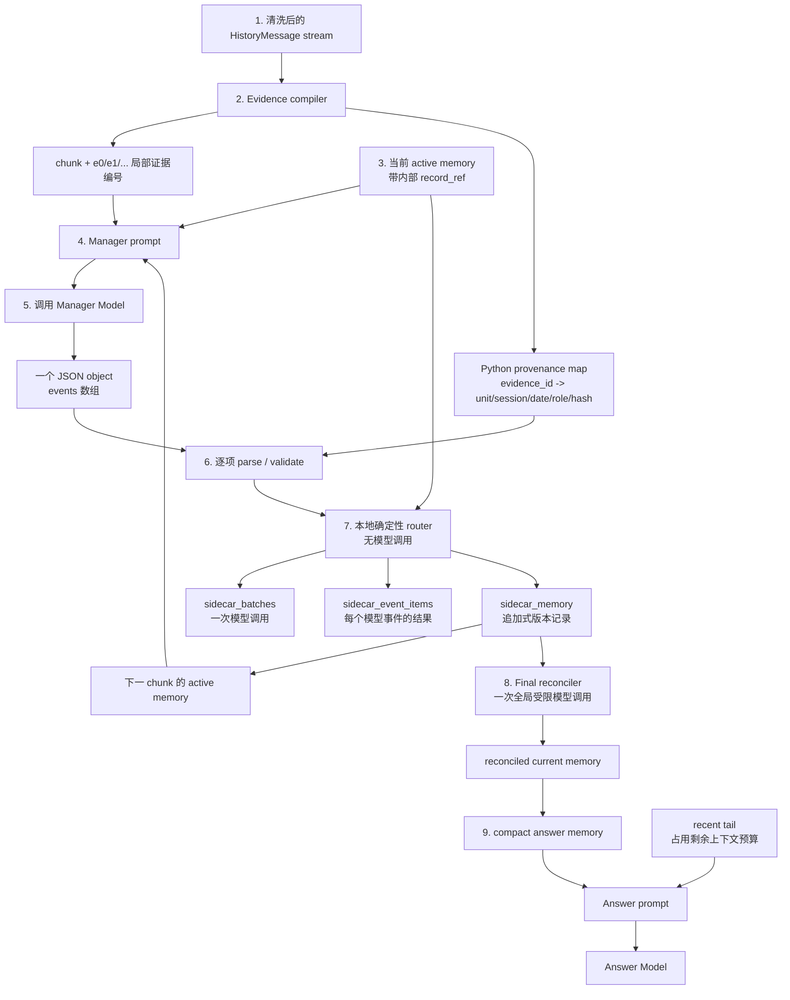
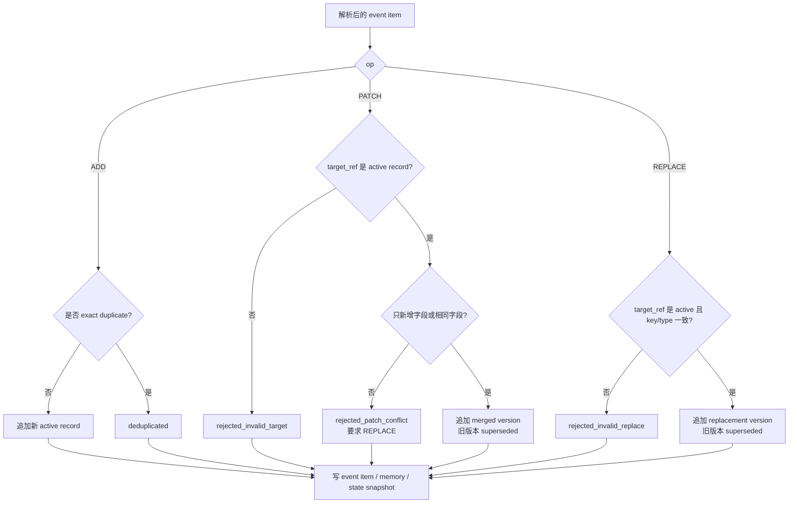
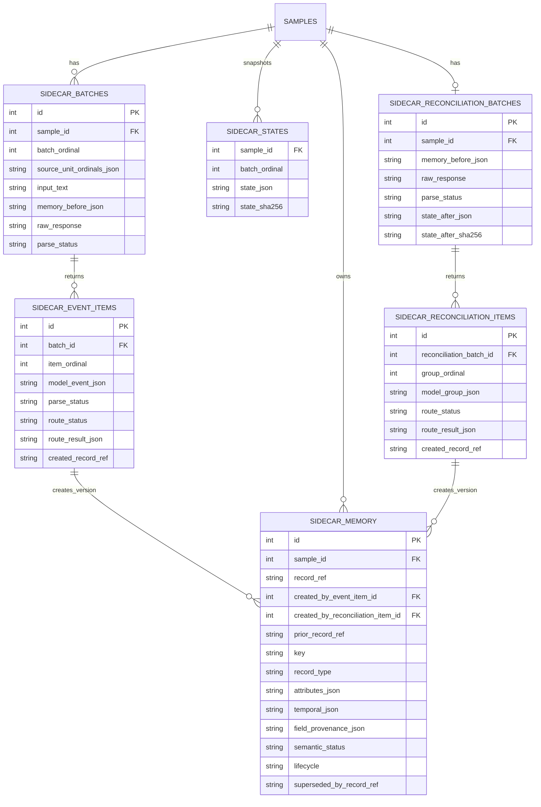
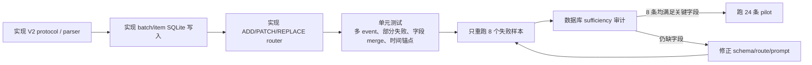

# Memory Sidecar V2 解决方案

## 1. 目标与边界

V2 只修复 V1 已确认的 memory 写入和 provenance 问题：一个 chunk 只能写一条事件、同 key 的补充事实被 `ADD` 冲突拒绝、金额/动作/相对时间等关键属性没有被结构化保存。

不修改以下内容：

- 最终 Answer Model、`answer_messages()` 和 DeepSeek judge；
- Answer 仍只使用 compact memory、recent tail、当前日期和问题；其中全部 `lifecycle=current` memory 优先，recent tail 使用其后的剩余上下文预算；
- 原始历史清洗、时间顺序和本地 tokenizer；
- V1 的 SQLite 结果。V2 使用新的 run 目录和新的数据库，不迁移或覆盖 V1 trajectory。

V2 的核心约束是：**模型只判断语义，程序负责已有的定位、编号、时间锚点和持久化信息。**

## 2. 单样本流程



### 2.1 图中过程说明

1. **构造历史流**：程序按 session 时间排序，把清洗后的 user/assistant 消息展开为连续 `HistoryMessage`。每条消息已有稳定的 `unit_ordinal`、session id、session 日期、role 和内容 hash；本步不调用模型。

2. **切 chunk 并编译证据**：程序按本地 tokenizer 将连续消息分成 chunk，并为当前 chunk 的每条消息编号 `e0`、`e1`、`e2`。同时在内存中保存 `evidence_id -> 原始 provenance` 映射。Manager 只看到短编号和正文，不需要重新生成 session id、原始下标或日期。

3. **读取工作记忆**：程序从本 sample 的 active memory 读取可更新记录，并为每条记录分配 `record_ref`，例如 `r17`。`record_ref` 只用于让 Manager 精确指定 PATCH/REPLACE 的目标，不是事实内容。

4. **构造 Manager prompt**：Python 将“有界 active memory + 当前 chunk 证据文本 + V2 JSON schema”拼成 prompt，并按 manager context budget 裁剪工作记忆。完整长期记忆仍保留在数据库，裁剪不会删除已写入的记录。

5. **调用 Manager Model，得到候选事件**：这是每个 chunk 唯一的一次 manager 调用。程序发送步骤 4 的 prompt，Manager 返回一个 JSON object，里面是 `events[]`。返回内容只是未受信任的候选；每个 item 只表达语义操作、结构化 attributes、时间表达和 `evidence_ids`，不负责写数据库，也不输出程序已有的 provenance 字段。

6. **逐 item 校验与 provenance 补全**：程序解析 `events[]` 中的每一项，校验字段、`target_ref` 和 `evidence_ids`。随后利用步骤 2 的映射补齐 `source_refs`、时间锚点和内容 hash。非法 item 被单独拒绝，不能影响同一批次其他合法 item。

7. **本地确定性路由并持久化（无模型调用）**：router 按 ADD/PATCH/REPLACE 规则生成新的记忆版本，必要时将旧版本标为 `superseded`。本步骤只运行 Python 和 SQLite：步骤 5 的那次模型调用对应一条 `sidecar_batches`，数组中的每个 item 写一条 `sidecar_event_items`，有效版本写入 `sidecar_memory`，随后保存 batch 完成后的 `sidecar_states` 快照。

8. **最终 reconciliation**：所有 chunk 处理完成后，程序读取全部 `lifecycle=current` records，进行一次受限的 Reconciler Model 调用。Reconciler 只识别“多条 record 是否为同一次事实/事件”的重复组，不能新增、删除、修改事实字段或直接写数据库；router 对通过校验的重复组创建合并后的 successor version。该调用及其逐组路由结果独立持久化。

9. **生成最终回答上下文**：程序从 reconciliation 后的 `sidecar_memory` 恢复全部 `lifecycle=current` 记录，投影为 compact answer memory。先计算该 memory、system prompt、问题和 Answer 输出预留所需 token，recent tail 使用模型上下文窗口中的全部剩余预算。若全部 current memory 本身已无空间容纳 Answer 输出，sample 标记为 `not_runnable`，验证阶段不裁剪或删除 memory。Answer Model 不能直接访问 Manager/Reconciler 的原始响应或内部审计字段。

`Evidence compiler` 是普通 Python 逻辑，不调用模型。它为当前 chunk 的每条 logical message 分配从 `e0` 开始的局部编号，同时保存不可变映射：

```text
e2 -> unit_ordinal=118
   -> session_id=answer_2880eb6c_1
   -> session_date=2023/05/05 06:24
   -> role=user
   -> content_sha256=...
```

Manager 在 prompt 中只看到短的 `e2` 和消息正文。它不输出 `session_id`、原始消息下标、`unit_ordinal`、session 日期、hash、event id 或置信度；这些字段由程序在路由时补齐。唯一需要模型返回的定位字段是 `evidence_ids`，因为只有模型知道某个语义事件由当前 chunk 的哪几条消息支持。

## 3. V2 Manager 输入与输出

### 3.1 Prompt 中的状态和证据

当前 active memory 中的每条记录由程序附加短的 `record_ref`。它只在模型要修改已有记录时使用，不是 session 元数据：

```json
{
  "records": [
    {
      "record_ref": "r17",
      "record_type": "event",
      "key": "user.bike.helmet.purchase",
      "semantic_status": "completed",
      "attributes": {"item": "Bell Zephyr helmet"},
      "normalized_time": "2023-04-10"
    }
  ]
}
```

当前 chunk 则按程序生成的局部证据编号呈现：

```text
## 2023/05/05 (Fri) 06:24
[e0][user] I have been keeping track of my bike mileage ... 347 miles ...
[e1][assistant] Congratulations on tracking your mileage ...
[e2][user] I bought my Bell Zephyr helmet for $120 at the local bike shop downtown.
```

`e2` 是当前请求内的短引用，不等于 session id 或全局 message index。程序可以由它恢复完整 provenance，因此无需让模型重复提取这些元数据。

### 3.2 模型唯一允许的 JSON

每个 chunk 返回一个 JSON object。没有可持久化信息时使用空数组，不再生成单独的 `NOOP` 事件。

```json
{
  "events": [
    {
      "op": "PATCH",
      "record_type": "fact",
      "key": "user.bike.helmet.purchase",
      "semantic_status": "completed",
      "attributes": {
        "item": "Bell Zephyr helmet",
        "amount": 120,
        "currency": "USD",
        "merchant": "local bike shop downtown"
      },
      "time_expression": null,
      "time_evidence_id": null,
      "evidence_ids": [2],
      "target_ref": "r17"
    }
  ]
}
```

字段含义：

| 字段 | 是否模型输出 | 含义 |
| --- | --- | --- |
| `events` | 是 | 当前 chunk 的全部独立记忆事件；空数组表示无事件。 |
| `op` | 是 | `ADD`、`PATCH` 或 `REPLACE`。 |
| `record_type` | 是 | `fact`、`preference`、`event`、`plan`、`assistant_fact`。 |
| `key` | 是 | 稳定、原子化的语义键，例如 `user.plant.snake_plant.acquisition`，不能用笼统的 `user.plants.owned` 承载多个独立事件。 |
| `semantic_status` | 是 | `active`、`planned` 或 `completed`；这是事实自身的语义状态，程序不能可靠推断。 |
| `lifecycle` | 否 | `current` 或 `superseded`；这是版本状态，由 router 写入。新版本为 `current`，被 PATCH/REPLACE 替代的旧版本为 `superseded`。 |
| `attributes` | 是 | 只保存可回答的语义字段，使用 JSON 标量、数组或浅层对象。金额必须拆成数值和币种，关系使用数组，避免把完整对话复制为字符串。 |
| `time_expression` | 是 | 当前 chunk 原文中的时间语义，如 `last Saturday`、`two weeks ago`、`April 10th`；当前 chunk 未表达时间时为 `null`。程序用 evidence 对应的 session 日期作为解析锚点。 |
| `time_evidence_id` | 仅有非空 `time_expression` 时 | 该时间表达所在的局部证据编号，必须属于 `evidence_ids`。程序只用它取得时间锚点。 |
| `evidence_ids` | 是 | 支持该事件的当前 chunk 局部证据编号，至少一个。 |
| `target_ref` | 仅 `PATCH`/`REPLACE` | `lifecycle=current` memory version 的 `record_ref`；`ADD` 不得出现。 |
| `session_id`、`message_indices`、`unit_ordinal`、`session_date`、`event_id`、`confidence` | 否 | 均由程序已有数据得到，禁止要求模型输出。 |

模型规则：一个独立、可被未来问题单独使用的事实必须是一条 event；同一条证据可以产生多条 event。不得因为一句用户消息同时包含“主话题”和“顺带事实”而只保留主话题。

例如 Spotify 与演唱会出现在同一 chunk 时，必须同时输出：

```json
{
  "events": [
    {
      "op": "ADD",
      "record_type": "event",
      "key": "user.music.concert.attended",
      "semantic_status": "completed",
      "attributes": {"artist": "The 1975"},
      "time_expression": null,
      "time_evidence_id": null,
      "evidence_ids": [0]
    },
    {
      "op": "ADD",
      "record_type": "fact",
      "key": "user.music.streaming_service",
      "semantic_status": "active",
      "attributes": {"service": "Spotify", "usage": "listening lately"},
      "time_expression": null,
      "time_evidence_id": null,
      "evidence_ids": [1]
    }
  ]
}
```

### 3.3 `ADD`、`PATCH` 和 `REPLACE`



- `ADD` 用于新的独立事实。`event` 类型允许同 key 的多次独立发生，例如两次 social-media break；去重依据事实的语义 identity，不以 evidence/source identity 作为去重条件。
- `PATCH` 用于补全同一事实缺失的字段。例如已经有头盔型号，后来补充 `$120`，新版本合并 `amount/currency`；不覆盖已有不同字段。
- `REPLACE` 用于后来的事实使旧状态失效，例如抵押额度从 `$350,000` 改为 `$400,000`。router 将旧版本的 `lifecycle` 写为 `superseded`，新版本写为 `current`；两者各自保留原有的 `semantic_status`。
- `rejected_*` 仅拒绝出错的 item，不丢弃同一个 JSON 数组中其他合法 events。原始 response 和所有 item 的路由结果均保存。

对于 `3a704032`，V2 不再把新增植物塞进 `user.plants.owned`。每株植物是独立记录，例如：

```json
{
  "op": "ADD",
  "record_type": "event",
  "key": "user.plant.snake_plant.acquisition",
  "semantic_status": "completed",
  "attributes": {"plant": "snake plant", "acquired_from": "sister"},
  "time_expression": "last month",
  "time_evidence_id": 4,
  "evidence_ids": [4]
}
```

因此新事实不会与 peace lily/succulent 的旧记录发生 `ADD` 冲突。

### 3.4 批内 target 冲突与版本路由

一个 batch 的全部 `events[]` 都基于调用前的 memory state 生成。若两个 `PATCH`/`REPLACE` 指向同一个 `target_ref`，二者都把同一旧版本视为 `current`；若按数组顺序应用，第一条会把旧版本标为 `superseded`，导致第二条失去合法 target。若同时接受二者，则会从同一旧版本产生两个并列的 `current` 分支，Answer 无法确定应读取哪一个版本。

V2 使用以下确定性规则，禁止这种版本分叉：

1. router 固定本 batch 开始前的状态为 `S0`；所有 `PATCH`/`REPLACE` 的 `target_ref` 必须在 `S0` 中存在且 `lifecycle=current`。
2. 预校验整个 `events[]`。同一 `target_ref` 在一个 batch 中至多允许出现一次 `PATCH` 或 `REPLACE`。
3. 若一个 target 出现多次修改，所有指向该 target 的修改 item 均写入 `sidecar_event_items`，并以 `rejected_duplicate_target_in_batch` 拒绝；不按数组顺序保留其中一条，也不由 router 自动合并。
4. 未冲突的 `PATCH` 创建一条合并后的新版本：旧版本的 `lifecycle` 变为 `superseded`，新版本的 `lifecycle` 为 `current`，并以 `prior_record_ref` 指向旧版本。`REPLACE` 同样只形成一条新版本链。
5. Manager 必须将同一既有记录的所有新增字段合并到一条 PATCH。例如对 `r17` 同时补充价格和商家时，输出一个包含 `amount`、`currency`、`merchant` 的 PATCH，而不是两条指向 `r17` 的 PATCH。

`semantic_status` 与 `lifecycle` 不可混用。例如，一次已完成购买的当前版本为 `semantic_status=completed, lifecycle=current`；被补充金额前的旧版本为 `semantic_status=completed, lifecycle=superseded`。Answer 只读取 `lifecycle=current` 的记录，且不因记录是 `planned` 而排除它。

### 3.5 ADD 的语义去重与 provenance 合并

同一事实可以在后续 session 被重复提及。`evidence_ids`、`source_refs`、`unit_ordinal`、内容 hash 和 session id 只用于证明与审计，不能参与“是否同一次事实”的 identity；否则用户重述一次既有购买会被错误记录为第二次购买，并在金额或次数问题中被重复累计。

router 对每个已完成 schema 校验、provenance 补全与时间解析的 ADD，在当前 batch 开始前的 `lifecycle=current` 记录中，按以下顺序判断。比较使用 canonical JSON，字段名排序且数组元素按 schema 规定的语义顺序规范化。这里的确定性去重只适用于有 `normalized_time` 或其他 schema 定义的 occurrence discriminator 的 event；两者都缺失的可重复 event 不在 chunk router 中合并，留给最终 reconciliation 判定。

1. 先筛选 `record_type`、`key`、`semantic_status` 均相同的 current records。
2. 若 occurrence 可确定且 `attributes` 与 `normalized_time` 都相同，命中 **exact identity**：不创建第二条语义 record，但为保证 `sidecar_memory` 版本不可变，创建一个 business fields 不变、`source_refs` 去重合并后的 successor version。旧版本变为 `lifecycle=superseded`，successor 为 `lifecycle=current`；item 标记为 `deduplicated_source_merged`。
3. 若 occurrence 可确定、`normalized_time` 相同，且所有重名 attributes 的值相同、其余字段仅存在于一侧，命中 **compatible identity**：将这次 ADD 本地转换为对既有 record 的 PATCH。新版本使用两侧字段的并集，旧版本变为 `lifecycle=superseded`，新版本为 `lifecycle=current`，并合并所有 source refs；item 标记为 `converted_add_to_patch`。
4. 若 occurrence 可确定、`normalized_time` 相同且存在任一重名 attribute 的不同值，标记为 `rejected_add_conflict`。router 不猜测这是一次事实更正还是第二次发生；Manager 必须明确输出指向旧 `target_ref` 的 REPLACE，或用能区分发生次数的属性输出新的 ADD。
5. 未命中以上情况时，创建新的 ADD record。对于无时间和 occurrence discriminator 的可重复 event，使用 `applied_occurrence_ambiguous` 标记写入，且不在此时合并。

例如，首次购买产生：

```text
key=user.bike.helmet.purchase
attributes={item: "Bell Zephyr helmet", amount: 120, currency: "USD"}
normalized_time=2023-04-10
source_refs=[unit 18]
```

用户在后续 session 以 `unit 42` 重述同一次、同日期、同金额的购买时，router 不创建第二条 `$120` purchase，而是创建一个语义字段不变、`source_refs=[unit 18, unit 42]` 的 successor version。若该次重述额外给出 `merchant`，router 创建一个补充 merchant 的新 PATCH version，而不会创建第二笔购买。

可重复发生的 `event` 必须把可区分 occurrence 的信息保存在 `normalized_time` 或 attributes 中。例如两次 social-media break 分别保存 `duration_days=10, normalized_time=2023-04-01` 和 `duration_days=7, normalized_time=2023-05-10`，因此会各自形成 ADD record；不得仅使用没有日期或其他 occurrence 字段的笼统 key/attributes，让 router 猜测是重述还是第二次发生。

### 3.6 最终 Reconciler：处理 occurrence 不充分的重复候选

对于两个没有日期或 occurrence discriminator 的相同 event，例如两个都为 `key=user.social_media.break, attributes={duration_days: 7}, normalized_time=null` 的 records，chunk router 无法可靠判断它们是同一次 break 的重述，还是两次独立 break。它们先各自保留，避免过早合并而遗漏真实发生次数。

全部 chunk 路由后，Reconciler 一次性读取 sample 的全部 `lifecycle=current` memory。它只允许输出可能重复的非空、互不重叠 record group：

```json
{
  "duplicate_groups": [
    {"record_refs": ["r-15-0", "r-28-1"]}
  ]
}
```

遗漏的 records 默认为保留。Reconciler 不得输出新 attributes、日期、key、状态、source、删除命令或自由文本解释；不确定时必须不输出该 group。

router 对每个 group 做确定性验证：所有 ref 必须属于该 sample 且为 `lifecycle=current`；同一 ref 不得出现在两个 group；同组 `record_type`、`key`、`semantic_status` 必须一致；attributes 只能相同或互补，重名字段不同则拒绝；两个已解析但不同的时间不得合并。通过后，程序选取最早创建的 ref 作为稳定 canonical parent，创建一个 attributes、temporal 和所有 field/source provenance 的兼容并集 successor version，并将 group 中所有旧 current versions 标记为 `superseded`。不通过的 group 写入逐组拒绝原因，且不改变任何 memory。全部 group 的 item 结果、memory 版本变更和 reconciliation 后 state snapshot 在一个 SQLite transaction 中提交，避免崩溃留下半完成的最终状态。

因此最终 reconciliation 只解决“是否同一次发生”的全局语义判断，事实内容、编号、版本链、provenance 合并和 SQLite 写入仍完全由程序控制。它能消除同一次购买/事件的重复累计，但不能修复 manager 漏抽取的事实。

## 4. 程序补全的 provenance 与时间

模型只返回 `evidence_ids`、原始 `time_expression` 和必要时的 `time_evidence_id`。router 补齐并保存如下结构：

```json
{
  "source_refs": [
    {
      "evidence_id": 2,
      "unit_ordinal": 118,
      "session_id": "answer_2880eb6c_1",
      "session_date": "2023/05/05 (Fri) 06:24",
      "role": "user",
      "content_sha256": "..."
    }
  ],
  "temporal": {
    "expression": "last Saturday",
    "time_evidence_id": 2,
    "anchor_session_date": "2023/05/05 (Fri) 06:24",
    "normalized_date": "2023-04-29",
    "resolver": "deterministic-v1"
  }
}
```

时间解析遵循以下规则：

1. 保留 `time_expression` 原文，不因解析失败而删除时间信息。
2. router 以 `time_evidence_id` 对应 session 的日期为锚点，用确定性解析器计算 `normalized_date`/`normalized_datetime`。
3. 无法无歧义解析时，`normalized_*` 为 `null`，但 expression、锚点和来源仍可供 Answer 或后续规则使用。
4. `time_evidence_id` 缺失、越界或不属于 `evidence_ids` 时，路由为 `rejected_invalid_time_evidence`，不猜测日期。

这样 `gpt4_d6585ce9` 的“last Saturday”和“with my parents”会分别成为 `temporal.expression` 与 `attributes.companions`，不再只留下一个没有日期的自然语言 value。

### 4.1 时间字段的来源与继承

`time_expression` 只能描述当前 chunk 的原文，不能把 active memory 中旧 record 的日期重新标注为当前 `time_evidence_id`。因此 PATCH 的时间行为单独定义如下：

1. 当前 chunk 明确包含时间表达：模型输出非空 `time_expression` 与有效 `time_evidence_id`。若 target 没有时间，PATCH 可以新增 temporal 字段；若 target 已有同一已解析时间，router 合并该时间字段的 provenance；若 target 已有不同时间，拒绝为 `rejected_patch_temporal_conflict`，要求模型使用 REPLACE。
2. 当前 chunk 只补充非时间 attributes：模型输出 `time_expression=null`、`time_evidence_id=null`。router 继承 target 的完整 temporal 字段及字段级 provenance，且不得把旧日期写为当前 chunk 的来源。
3. ADD 没有时间表达时，其 temporal 字段为空；REPLACE 的非空时间必须由当前 chunk 的有效 evidence 支持，空时间表示新版本没有已知时间，不能从被替代版本隐式继承。
4. 时间 provenance 的合并与其他字段一样遵循追加式版本：router 创建合并 provenance 的 successor version，而不原地编辑 current record。

例如，已有 `r17` 的 `normalized_date=2023-04-10` 来自早期 `unit 8`。当前 `e2` 仅说“头盔花了 $120，购自 downtown bike shop”。正确输出是一条 `time_expression=null` 的 PATCH；router 生成的新版本，新增金额和商家字段的 provenance 指向 `e2`，但日期仍继承 `unit 8`。不得输出 `time_expression="April 10th", time_evidence_id=2`，因为 `e2` 没有该时间表达。

字段级 provenance 的规则是：初次 `ADD` 时，每个 `attributes` 字段都关联本 event 的 `source_refs`；`PATCH` 只为新增字段写新 provenance，未变字段继承旧版本 provenance；`REPLACE` 写入新版本的完整 provenance。最终 Answer prompt 不展示这些审计字段，只展示紧凑的 key、`semantic_status`、attributes 和已解析时间。

## 5. SQLite 记录结构

V2 将“一次 manager 调用”和“该调用中的多个 event item”拆开存储：



| 表 | 一行表示什么 | 关键用途 |
| --- | --- | --- |
| `sidecar_batches` | 一次 manager 模型调用，即一个 chunk | 保存原始 response、输入文本和写入前 state；即使整个 JSON 无法解析也可审计。 |
| `sidecar_event_items` | `events[]` 中的一个候选 | 单独保存 parse/route 成败，避免一个坏 item 影响同批其他 item。 |
| `sidecar_memory` | 一个不可变的记忆版本 | 保存结构化 attributes、时间、字段级 provenance、`semantic_status` 与 `lifecycle`；PATCH/REPLACE 均创建新版本。 |
| `sidecar_states` | 一个 batch 全部路由完成后的状态快照 | 支持回放和与 memory 表的一致性校验。 |
| `sidecar_reconciliation_batches` | 每个 sample 的一次最终 Reconciler 调用 | 保存全量 current memory 输入、原始 response、解析状态和 reconciliation 后 state snapshot。 |
| `sidecar_reconciliation_items` | `duplicate_groups[]` 中的一组候选 | 保存逐组校验/路由结果和合并 successor record，避免一个非法 group 影响其他合法 group。 |

`record_ref`、`batch_ordinal`、`item_ordinal` 和数据库主键全部由程序生成。`record_ref` 只需在同一 sample 内唯一，表约束为 `UNIQUE(sample_id, record_ref)`；推荐 manager record id 格式为 `r-{batch_ordinal}-{item_ordinal}`，例如 `r-15-2`，最终 reconciliation 生成 `r-final-{group_ordinal}`。`prior_record_ref` 与 `superseded_by_record_ref` 同样按 sample 解析。`sidecar_memory` 的两个 creator FK 恰有一个非空，分别表示由 manager item 或 reconciliation group 创建；模型不得生成这些字段。

## 6. 对 8 条上下文失败的直接覆盖

| failure | V2 机制 | 可验证条件 |
| --- | --- | --- |
| `gpt4_d84a3211` | 一条 helmet purchase event，`amount=120` | 最终 memory 有 `amount=120` 和来源 `unit_ordinal=118`。 |
| `bf659f65` | 音乐事件 attributes 强制表达 `action=purchased/downloaded` | Tame、Whiskey、Billie 三条记录均可按动作计数。 |
| `ccb36322` | `events[]` 同时返回 concert 和 streaming service | Spotify item 不因 The 1975 item 而消失。 |
| `3a704032` | 每株植物独立 key；新增不触发列表 key 冲突 | snake plant acquisition active，来源是 sister 消息。 |
| `dd2973ad` | 医生预约和 bedtime 各一条 event，保留相对时间 expression 和解析结果 | 能从两个标准化日期推出前一天的 `2 AM`。 |
| `gpt4_d6585ce9` | `companions=["parents"]` 与 `time_expression="last Saturday"` 分字段保存 | Queen 事件可被按日期定位。 |
| `81507db6` | 一个 chunk 可同时保留 certification plan 和 Rachel graduation | Rachel graduation record 存在且不依赖计划记录。 |
| `6cb6f249` | 两次 break 是两个 `event` ADD record，不因同 key 互相冲突 | 10 + 7 的时长字段均存在，可累计为 17。 |

## 7. 实施顺序与验收



第一轮只重跑已审计的 8 条，保持 manager、Answer Model、tokenizer、问题和“完整 current memory 优先、tail 使用剩余预算”的 Answer 上下文策略不变。验收不看总体准确率，先看数据库事实是否充分：

1. 每个 gold 所需事实都能在 `sidecar_memory` 的 `lifecycle=current` record 找到，并能追到 `source_refs`。
2. 同一个 batch 的多个合法 events 全部各自拥有 `sidecar_event_items` 行和 route 结果。
3. 不再使用“缺少 source 时默认整个 chunk”的 provenance 兜底；缺失或非法 `evidence_ids` 的 item 必须拒绝。
4. `PATCH` 不得静默覆盖冲突字段；`REPLACE` 必须保留 superseded version。
5. V2 的 Answer prompt 必须使用全部 `lifecycle=current` memory；recent tail 只使用 memory、system prompt、问题和 Answer 输出预留后的剩余预算，并记录实际 tail token 数。
6. 同一 batch 内重复修改同一个 `target_ref` 时，所有冲突 item 必须为 `rejected_duplicate_target_in_batch`，且不得产生新的 `current` 分支。
7. 同一购买/事件被不同 session 重述时，必须只保留一个 current semantic record 并合并 `source_refs`；补充字段必须形成 PATCH version，不得使 Answer 对同一发生次数或金额重复累计。
8. 最终 Reconciler 只能输出不重叠的 `duplicate_groups`；非法或不确定 group 不得改变 memory。通过的 group 必须保留全部来源并仅形成一个新的 current successor version。

8 条 memory sufficiency 全部通过后，再运行同一 24 条 manifest 并沿用现有 DeepSeek judge。只有这时才比较 V2 与 V1 的上下文失败数和准确率；不将“模型最终回答错误”误记为 memory 修复效果。
