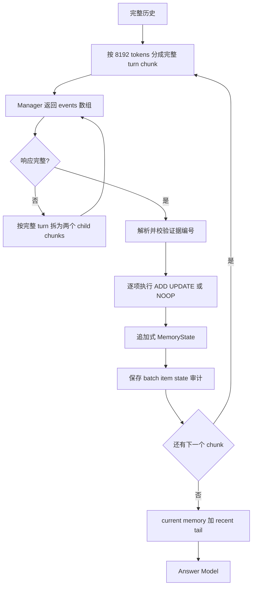
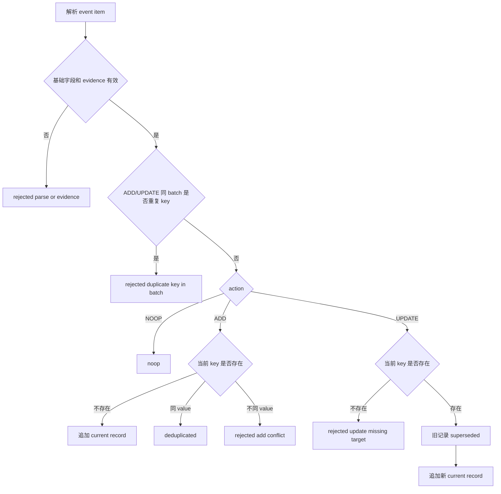

# Memory Sidecar V3 方案

## 1. 决策

V3 不在 V2 上继续增加修补逻辑，而是以 V1 为基线重新实现一个小协议：

```text
V1 的 ADD / UPDATE / NOOP 和追加式 superseded 历史
+ V2 的一次多事件输出
+ V2 的 chunk 内证据编号与逐事件审计
+ V2 的明确金额、动作、关系与时间提示
- V2 的 PATCH / REPLACE / target_ref
- V2 的字段级合并与冲突拒绝
- V2 的 Reconciler
- V2 的 money repair 与 repair merge
- V2 的 record_ref 版本链和字段级 provenance
```

目标不是一次解决所有记忆推理问题，而是验证一个可解释的问题：**在不增加状态路由复杂度的情况下，多事件抽取和整体 UPDATE 能否修复 V1 的主要事实遗漏，并避免 V2 的状态回归。**

## 2. 背景与问题边界

V1 的核心问题是每个 chunk 只能产出一个事件；一个 chunk 中多条独立事实会相互抢占。V2 解决了多事件抽取，但同时引入 batch snapshot、`target_ref`、PATCH/REPLACE、字段冲突、版本链、Reconciler 和金额二次修复。24 条 pilot 中，V2 的总体准确率从 V1 的 41.67% 提升到 50.00%，但 `knowledge-update` 从 4/4 降至 0/4。

V3 只处理以下三类问题：

1. 一个 chunk 中的多个独立事实必须都能落库。
2. 后续明确给出的同一状态新值必须替换旧值。
3. 计划、实际观察和已完成事件必须在语义上分开，避免 Answer 把目标当事实。

以下能力明确不属于 V3：

1. 自动从实体变动推导聚合计数，例如自动把 `37` 枚硬币加到 `38`。
2. 自动判断无日期的两个事件是否是同一次发生。
3. 字段级属性合并、跨记录去重、最终全局 reconciliation。
4. 对模型遗漏事实的第二次 LLM 修复调用。
5. 在同一个 key 下保留并比较多个并行 current 分支。
6. 用 embedding、编辑距离或其他模糊相似度自动把两个不同字符串 key 合并或路由为 UPDATE。

## 3. 设计目标与验收条件

| 目标 | V3 机制 | 验收条件 |
| --- | --- | --- |
| 多事实不丢失 | 单个 Manager response 返回 `events` 数组 | 一个 chunk 的多个独立事实可分别审计和路由 |
| 更新可表达 | `UPDATE` 整体替换同 key 的当前值 | `$350,000 -> $400,000`、Chicago -> suburbs 产生一个 current 新值和一个 superseded 旧值 |
| 状态语义清楚 | key 规范区分 `target`、`observed`、`completed` | 周末目标 `8:00` 不覆盖周六实际观察 `7:30` |
| 路由简单 | 不要求 `target_ref`，不做字段合并 | 不存在 `rejected_patch_conflict`、`target_mismatch`、repair merge 分支 |
| 可回放 | 每个 batch 原始输出、每个 item 路由结果、每次状态快照落库 | 可从 SQLite 还原每个 active/superseded 状态的来源 |
| 成本可控 | 每个成功的 leaf chunk 对应一次 Manager 调用 | 不调用 Reconciler 和 money repair；截断父请求单独审计 |

V3 pilot 的通过门槛：

1. 四条 `knowledge-update` smoke 样本必须各自通过预定义状态断言：贷款为 `$400,000` current 且 `$350,000` superseded；硬币基数和 1915-S 新增实体均为 current；周末 target 与周六 observed 同时存在且互不 supersede；Rachel 的 suburbs 为 current、Chicago 为 superseded。
2. 四条样本中不得出现 `target_ref`、字段合并、Reconciler、money repair 或 repair merge；所有 current record 都必须可回溯到精确的 evidence refs。
3. 每个完成样本必须分别审计：`terminal_leaf_manager_batches == effective_leaf_chunk_count`、`answer_completions == 1`、`manager_completion_requests == terminal_leaf_manager_batches + truncated_parent_requests`。完整返回但 item/schema 非法的 leaf 仍计入 terminal leaf batch，另以 route/parse 状态报告。预检和 HTTP transport retry 不计入这些 logical completion，但必须在 run 元数据和调用日志中单列其 attempts，不能混入或遗漏。
4. Answer 使用与滚动摘要相同的共享上下文预算；current memory 优先保留，超出预算时只从 recent tail 的较早端按完整 turn 截断，不裁掉 current record。
5. 通过单元和离线集成测试后，再运行四条 smoke；只有全部状态断言、来源回放和调用数断言符合预期才运行完整 pilot。

## 4. 总体流程

下图回答“V3 一条历史如何形成最终答案”：每个成功的 leaf chunk 只进行一次抽取，程序只执行简单的 ADD/UPDATE/NOOP 路由。截断响应会将其原始 chunk 在 turn 边界拆为更小的 leaf chunks。



1. `A-B`：沿用现有 `chronological_sessions`、turn 边界和本地 tokenizer。chunk 预算默认 8192，绝不拆分一个完整 turn。
2. `C-D`：Manager 每个 leaf chunk 只调用一次，返回多个候选事件。普通 item 解析失败只拒绝对应 item，不中断同 batch 的其他有效 item。若整个响应有 `finish_reason=length`，或 JSON decoder 可明确判定为未闭合的截断 JSON，则不应用其中任何 item；将原始 chunk 在完整 turn 边界二分为 child chunks，前半成功提交后，后半使用更新后的 state 处理。完整返回但格式非法的 JSON 只记为 `rejected_parse`，不触发拆分。
3. `E-F`：路由依据规范化后的稳定 key，不需要模型提供内部记录 ID；未知的同义 key 不由 router 猜测合并。
4. `G`：数据库保留 Manager 输入、原始响应、每个 item 的结果和路由后的状态快照。路由先在当前 state 的副本上执行；只有 SQLite transaction 成功提交后，才替换进程内 state。
5. `I-J`：Answer 只读取 current records 和 recent tail；不读取 superseded records。current memory 与 recent tail 共用滚动摘要的上下文预算（默认沿用 `compress_prefix_tokens`，当前基线为 80K；实验可统一设置为 100K）。超出预算时保留完整 current memory，并从 recent tail 的较早端按完整 turn 截断。

## 5. 事件协议

### 5.1 顶层格式

Manager 必须返回一个 JSON object：

```json
{
  "events": [
    {
      "action": "ADD",
      "memory_type": "fact",
      "key": "mortgage.wells_fargo.preapproval",
      "value": {
        "amount": 400000,
        "currency": "USD",
        "lender": "Wells Fargo"
      },
      "status": "active",
      "event_date": null,
      "source": {"evidence_ids": [18]},
      "confidence": 0.95,
      "qualifier": null
    }
  ]
}
```

每个 item 的字段如下：

| 字段 | 规则 |
| --- | --- |
| `action` | `ADD`、`UPDATE`、`NOOP` 三选一 |
| `memory_type` | ADD/UPDATE 必填；`fact`、`preference`、`event`、`plan`、`assistant_fact` |
| `key` | ADD/UPDATE 必填；稳定、与实体及属性绑定；不包含当前值，例如 `person.rachel.location` |
| `value` | ADD/UPDATE 必填；JSON scalar、array 或 object；必须保留回答所需的精确数值、名称、动作、关系和货币 |
| `status` | ADD/UPDATE 必填；`active`、`planned`、`completed`；`superseded` 只能由路由器写入 |
| `event_date` | ADD/UPDATE 必填；原文已明确或可确定时填写 ISO 日期；否则 `null` |
| `source.evidence_ids` | ADD/UPDATE 必填；当前 chunk 的非空局部证据 ID 整数数组，例如 `[0, 3]` |
| `confidence` | `0..1` 或 `null`，仅用于审计，不改变路由 |
| `qualifier` | 范围、条件或时间说明；没有则 `null` |

`NOOP` 只能是 `{ "action": "NOOP" }`，不需要 key、value 或 source；无持久信息时优先返回空数组 `{"events": []}`。NOOP 不参与同 key 重复预扫描。

V3 的局部 `e0`、`e1` 编号与 V2 一样，由程序在每个 chunk 内生成。程序必须将每个被引用 ID 无损映射并持久化为：

```json
{
  "source_refs": [
    {"evidence_id": 0, "session_id": "s-12", "message_index": 4, "unit_ordinal": 87}
  ]
}
```

一个 event 可以引用跨 session 的多个 ref；不得将它们压缩成单一 `session_id + message_indices`，也不得把整个 chunk 当作 event 的来源。Manager 不得构造 session ID、数据库 ID 或 `target_ref`。

`evidence_ids` 与 `source_refs` 是两个不同层次的字段：`evidence_ids` 原样保留在
`model_event_json` 中，供审计 Manager 的引用；`source_refs` 是程序根据当前 chunk 的
evidence map 解析出的唯一持久化 provenance，写入 `sidecar_memory.source_json`。V3
record 的 `source_json` 必须始终是 `{"source_refs":[...]}`；Answer projection 若需要可读
来源，必须从这些 refs 明确生成，不能依赖 V1 的单一 `session_id/message_indices` 结构。
evidence ID 越界、重复、非整数或缺失时，该 item 独立标记为
`rejected_invalid_evidence`，不得使用整个 chunk 或默认 source 兜底。

每个 event item 使用稳定的复合 ID：`b{batch_ordinal}-i{item_ordinal}`。`batch_ordinal`
和 `item_ordinal` 必须单独写入审计表，回放和排序按二者进行，不能从字符串最后一段
推断全局 ordinal。该 ID 同时用于 `sidecar_memory.event_id` 和 `superseded_by`，保证
跨 batch 唯一；被拒绝的 item 也保留其 item ordinal，但不写入 memory record。

### 5.2 ADD、UPDATE 与 NOOP

| 动作 | 前置条件 | 路由结果 |
| --- | --- | --- |
| `ADD` | 当前没有相同 key 的 active/planned/completed record | 新建 current record |
| `ADD` | 当前已有同 key 且 value 完全相同 | `deduplicated`，不改状态 |
| `ADD` | 当前已有同 key 但 value 不同 | `rejected_add_conflict`，提示模型后续应使用 UPDATE |
| `UPDATE` | 当前存在同 key record | 该 key 的所有 current 旧记录标为 `superseded`，追加一个新 current record |
| `UPDATE` | 当前不存在同 key record | `rejected_update_missing_target`，不猜测要更新什么 |
| `NOOP` | 无持久信息 | 不改状态 |

**UPDATE 是整体替换，不是字段合并。** 如果值是 object，后续 object 必须是该状态的完整新快照；程序不比较 `amount`、`location`、`detail` 等单个字段，也不会拒绝一个较晚的不同值。

UPDATE 的 exact key 命中还必须通过基本类型兼容校验：已有 current record 的
`memory_type` 必须与 event 的 `memory_type` 相同；不兼容时返回
`rejected_update_type_mismatch`，不 supersede 旧记录。计划、观察和完成事件应优先使用
不同 key 表达；router 不根据 status 猜测它们之间的关系。

这条规则让下列更新变为合法：

```text
mortgage.wells_fargo.preapproval:
  $350,000 -> UPDATE -> $400,000

person.rachel.location:
  Chicago -> UPDATE -> suburbs near Tampa, Florida
```

旧记录仍然存在，但状态为 `superseded`，并带有 `superseded_by` 指向新事件 ID。Answer 默认只消费 current records。

### 5.3 同一 batch 的规则

所有 ADD/UPDATE item 都以 **batch 开始前的状态** 校验。一个 batch 不允许产生同 key 的两个状态改变：

```text
ADD x + UPDATE x
UPDATE x + UPDATE x
```

上述 ADD/UPDATE item 全部标为 `rejected_duplicate_key_in_batch`，本 batch 不改变 `x`。NOOP 不参与该检查。原因是模型只看到了 batch-before snapshot，不能可靠地让后一项基于前一项的新值。

同一 batch 可以有多个不同 key：

```text
ADD bike.chain.purchase
ADD bike.light.purchase
ADD bike.helmet.purchase
```

这三项可并行通过路由。batch 内的顺序只决定审计 item ordinal，不表达更新依赖。

对于可累积的 `event` occurrence，key 必须包含稳定的实例区分信息（例如日期、实体、
地点或明确的序号）。如果原文没有任何可区分信息，不得把两个不同 occurrence 静默写入
同一个 snapshot key；该 item 标记为 `rejected_ambiguous_occurrence_key`，并计入审计。
同一 occurrence 的重复陈述仍可用同值 ADD 去重。V3 不为无日期 occurrence 猜测事件
身份，也不把不同 occurrence 自动合并。

## 6. Key 与状态语义规范

V3 的准确性主要依赖 key 语义；以下约束必须进入 Manager prompt 和单元测试。

### 6.1 可变快照

对于“现在是什么”的属性，使用一个稳定 key，并用 UPDATE 替换：

```text
person.rachel.location
mortgage.wells_fargo.preapproval
collection.pre_1920_american_coin.count
```

不要把旧值放入 key，例如：

```text
禁止：fact_rachel_moved_chicago
推荐：person.rachel.location
```

因为值变化应该由 UPDATE 表达，而不是通过另一个 key 创建平行事实。

### 6.2 计划、偏好和实际观察

不得把目标和观察写在同一个 key 或同一个混合 value 中：

```text
routine.weekend.wake_target       = 08:00
routine.saturday.wake_observed    = 07:30
```

如果日期已知，实际观察使用日期作为事件 key 后缀：

```text
routine.saturday.wake_observed.2023-06-03
```

如果日期未知，记录为 completed event 并携带 session/source；不要把它 UPDATE 到计划目标。

### 6.3 可累积事件和计数

新增硬币、一次购买、一次旅行等是 occurrence，应使用不同 key 或含日期/实体的 key：

```text
collection.pre_1920_american_coin.item.1915_s_barber_quarter
expense.bike.helmet.2023-04-10
```

V3 **不自动修改** `collection.pre_1920_american_coin.count`。只有原文明确给出新的总数时，Manager 才能 UPDATE count。最终 Answer 可以基于“明确基数 + 明确新增实体”做计算，但必须在 prompt 中要求列出参与计算的 records；若不能可靠计算，应说明不足，而不能虚构新总数。

这一区分能把“抽取是否保留了基数和新增实体”与“答案模型是否完成了算术”分开审计。

### 6.4 金额记录

任何明确支付、购买、安装、维修或费用金额必须为独立事件，value 至少含：

```json
{
  "item": "Bell Zephyr helmet",
  "action": "purchased",
  "amount": 120,
  "currency": "USD"
}
```

金额校验只做观测，不触发第二次模型调用：

1. 程序扫描当前 user evidence 中明确的美元金额；assistant 证据中的金额单独计为 `assistant_money_mentions`，不混入该覆盖率。
2. 只有路由结果为 `applied` 或 `deduplicated` 的 event，才可用相同 evidence ID 和规范化后的 `value.amount` 覆盖该金额。`rejected_add_conflict`、重复 key、parse error 和 missing target 均不覆盖。
3. 未覆盖金额记录为 `money_coverage_missing` 审计字段和 run 指标，并保存 evidence ID、原文金额、候选 item 及最终 route status。
4. event 仍按通常规则路由；不会因为同 batch 其他金额遗漏而丢弃已经正确的 UPDATE。

### 6.5 同义 key 与 key identity

V3 的正式路由身份不是原始字符串，而是**受限、确定性的 canonical key**：

1. Manager 看到已有状态发生更新时，必须从 `complete active key index` 原样复制已有 key；这是 UPDATE 的首选路径。
2. Router 只允许无语义损失的规范化：Unicode/ASCII 大小写统一、连续分隔符归一、首尾空白清除，以及事先冻结的有限别名表。例如 `current_location` 可以规范到 `location`，但别名表必须是代码和测试的一部分，不能由模型或运行时动态扩展。
3. 对规范化后仍不相同的 key，按两个独立 key 处理。不能因为 `person.rachel.location` 与 `person.rachel.current_location`、`mortgage.preapproval` 与 `mortgage.preapproval_amount` 的字符串或 embedding 相似，就自动 supersede 其中一个。
4. 未命中已有 key、但与某个 current key 相似的事件，保留为 `rejected_key_drift`（或 `key_drift_candidate` 审计项），不改变 memory。审计记录候选旧 key、规范化 key、相似度方法/分数和 evidence，但不把分数当作路由依据。
5. 相似度计算可以离线用于发现 prompt/key 规范问题，也可以生成供人工复核的候选对；它不参与 V3 pilot 的状态写入、准确率计算或 completion 数。

因此，V3 的同义 key 处理顺序固定为：

```text
原始 key
  -> deterministic canonicalization
  -> exact match against complete current key index
  -> ADD / UPDATE / deduplicated
  -> no exact match: new key or key-drift audit, never fuzzy UPDATE
```

如果后续实验确认 key drift 是主要瓶颈，V4 才可单独评估“结构约束下的候选相似度”：必须先证明实体 identity、属性 family 和 status 兼容，再采用固定阈值，并设置 `ambiguous` 拒绝分支；不能只用一个全局 cosine threshold。

## 7. 路由器

下图回答“一个 V3 item 如何改变状态”：路由器没有字段合并和内部 target 解析。



1. `A-B`：校验 action、type、key、status、source evidence ID 及金额字段的基本类型；每个 evidence ID 必须存在于当前 compiled chunk。无效 item 独立拒绝。
2. `D-E`：仅对 ADD/UPDATE 在路由前预扫描 batch，防止模型在没有中间状态可见性的前提下对同 key 进行多次变更。
3. `H-I-J-K`：ADD 只用于新状态；同值重述可去重，不同值必须显式 UPDATE。
4. `L-M-N-O`：UPDATE 始终替换整个 current value。不存在旧状态时拒绝，而不是悄悄降级成 ADD。

### 7.1 路由不变量

1. 对任意可变 key，路由后最多存在一个 current record。
2. 每个 superseded record 都必须指向同 key 的后继 event ID。
3. 一个拒绝 item 不得改变状态。
4. batch 的所有合法 item 都基于同一个 batch-before snapshot 判断。
5. 所有 current record 都至少带一个有效 source evidence。
6. 不存在额外的语义 LLM completion、repair 或隐式字段合并；网络层 retry 只能重试同一请求，必须记录 attempt 数，不能产生新 prompt 或新事件。
7. 路由不得直接修改待提交的共享 state。batch 必须在 state 副本上完成；事务提交失败时丢弃副本，下一 batch 只能从最后一个已提交 snapshot 继续。
8. 对 Manager 响应，若 HTTP 返回 `finish_reason=length`，或 JSON decoder 可明确判定为未闭合的截断 JSON，不得把已截出的半个数组当作有效多事件结果。该父请求记为 `truncated_parent`，不改变 state；程序在完整 turn 边界把其 source chunk 二分，递归处理 child chunks。完整返回但格式非法的 JSON 只记为 `rejected_parse`，不拆分。若 source chunk 已是单一不可拆 turn，记为 `manager_output_unfit`，不无限重试。

## 8. Prompt 方案

Manager system prompt 使用 V1 的“结构化 memory controller”角色，并增加以下硬约束：

```text
- Return one JSON object with an events array. One message may yield multiple independent events.
- Use ADD only for a new stable key. Use UPDATE only when a later message explicitly changes an existing key. When updating, copy the existing key exactly from the supplied key index; never invent a paraphrase of that key.
- UPDATE replaces the entire value for that key. Do not use PATCH, REPLACE, target_ref, record_ref, or field-level edits.
- Separate targets or plans from observed or completed facts with different keys.
- For every explicit purchase or paid amount, emit a separate event that includes action, item, amount, and currency.
- Preserve exact names, numbers, dates, relationships, and qualifiers required by future questions.
- Cite only local evidence IDs supplied in this chunk.
```

Manager context 展示：

```text
complete active key index
complete current record snapshots
recent superseded update ledger per key
current chunk evidence e0...eN
```

`complete active key index` 至少包含每个 current record 的 key、memory_type 和 status；snapshot 包含完整 value，不得只保留“最近 N 条”。Manager 与滚动摘要使用同一实验上下文预算配置；current snapshot 是不可裁剪的状态事实，预算不足时不得沿用 V1 的最近记录裁剪。这样 UPDATE 永远能看到待替换 key 和完整旧快照。Answer 侧若超出共享预算，只裁剪 recent tail 的较早端。

不展示 V2 `record_ref`，不要求模型挑选内部记录 ID。update ledger 保留 V1 行为，帮助模型理解更新方向，但不参与确定性路由。Manager 生成的 key 与已有 key 仅允许通过上述 canonicalization 后的 exact match 关联；相似度结果只能写入审计。

Answer prompt 沿用 V1 的数值、比较和时间推理说明，并补充：

```text
- Treat only the supplied current records as current state; superseded records are not supplied.
- Distinguish target or planned values from observed or completed values.
- For a count, enumerate an explicit baseline and later explicit member additions before doing arithmetic.
```

## 9. SQLite 与审计

V3 不新建第三套复杂 memory 表。状态层复用 V1 的：

```text
sidecar_memory
sidecar_states
```

其中 `sidecar_memory` 继续保存完整追加历史，`status` 表示 `active`、`planned`、`completed` 或 `superseded`。V3 migration 为该表增加 `batch_ordinal`、`item_ordinal` 两列，并以 `(batch_ordinal, item_ordinal, id)` 回读排序；不得再从 `event_id` 推导 `event_ordinal`。`source_json` 写入上述 `source_refs[]`，`source_unit_ordinals` 只写该 record 实际引用的 unit ordinals。V3 的 Answer projection 必须从 SQLite 回读后过滤 `status == superseded`，而不是复用 V1 的全量 `render_for_answer()`。V3 不写 `sidecar_memory_v2`。

为支持多事件审计，V3 复用已经存在的批次容器：

```text
sidecar_batches
sidecar_event_items
```

但写入的 item 使用 V3 schema：

```text
model_event_json      V3 action/value/source 事件
route_status          V3 路由结果
created_record_ref    NULL，不使用 V2 record_ref
```

`sidecar_batches` 和 `sidecar_event_items` 在 V3 中只是“一个 Manager 调用及其多个输出”的审计容器，不意味着复用 V2 路由、版本链或 reconciliation 语义。

V3 migration 为 `sidecar_batches` 增加 `parent_chunk_ordinal`、`split_depth` 和
`split_reason`。初始 chunk 的 `parent_chunk_ordinal` 为 `NULL`、`split_depth=0`；由截断
拆出的 child batch 记录原始父 chunk、深度和 `split_reason=output_truncated`。截断父请求
自身也写 batch 原始输入和响应，但不写 applied memory/event item。多个 child batch 的
状态按时间顺序提交：前半 child 完整提交后，后半 child 才读取其 state。

`TrajectoryStore.record_v3_batch(...)` 是 V3 唯一的 batch 写入入口。它在一个显式 SQLite transaction 中直接执行 SQL，不能调用会自行 `commit` 的现有 `record_sidecar_batch()`、`record_sidecar_event_item()`、`sync_sidecar_memory()` 或 `record_sidecar_state()`。

每个 Manager batch 的 SQLite 事务范围为：

```text
写 batch 原始输入和原始输出
写所有 event item 的解析及路由结果
同步 V1 sidecar_memory
写 V1 sidecar_states snapshot
```

如果其中任何一步失败，整个 batch rollback；下一 batch 只能看到已完整提交的状态。

事务实现必须遵循以下顺序：先复制 `MemoryState`，在副本上完成全部 item-local parse 和
route，再在一个显式 transaction 中写 batch、items、memory 和 state snapshot；commit
成功后才将副本提升为进程内当前 state。若任一步 SQL 或序列化失败，rollback 并丢弃
副本。重试不得复用部分写入的 event ID，也不得让失败 batch 的新状态进入下一 chunk。

建议增加以下 V3 run 指标：

| 指标 | 定义 |
| --- | --- |
| `terminal_leaf_manager_batches` | 未触发 split 的最终 leaf Manager batch，含完整返回但 item/schema 非法的响应；等于 `effective_leaf_chunk_count` |
| `manager_completion_requests` | 所有 Manager logical completion 请求；等于 terminal leaf batch 加截断父请求，不含 HTTP retry |
| `answer_completions` | 已完成的 Answer logical completions；每个 completed sample 恰为 1 |
| `completion_attempts` | 每个 logical completion 的 HTTP attempts 总数；与 logical completion 分开报告 |
| `event_items` | Manager 返回的有效和无效 item 总数 |
| `route_status_counts` | 每种路由状态的数量 |
| `key_drift_candidates` | 与 current key 近似但未 exact match 的 item 数量；只做审计，不改变状态 |
| `multi_event_batch_rate` | `events.length >= 2` 的 batch 比例 |
| `money_coverage_missing` | 未被 applied/deduplicated event 覆盖的用户美元金额数量 |
| `updated_keys` | 成功 UPDATE 的 key 数量 |
| `rejected_duplicate_key_in_batch` | batch 可见性错误数量 |
| `truncated_parent_requests` | 因输出达到长度上限或顶层 JSON 截断而触发 chunk split 的父请求数；每发生一次截断即加一，作为诊断指标 |
| `manager_output_unfit` | 不可拆的完整 turn 仍触发输出截断，无法继续分割的次数 |
| `effective_leaf_chunk_count` | 递归 split 后实际成功处理的 leaf chunks 数 |
| `current_memory_over_budget` | current memory 本身超过服务端硬上限的 sample 数；不得静默删 record |
| `recent_tail_trimmed_tokens` | 因共享预算从 recent tail 较早端截去的 token 数 |

## 10. 实现范围

建议新增或修改的模块如下：

| 模块 | 改动 |
| --- | --- |
| `memory_sidecar/v3.py` | V3 item-local parser、局部 evidence 编译及无损 source refs、batch router、current-only Answer projection、prompt 与状态 hash |
| `memory_sidecar/process_v3.py` | 单样本串行 chunk loop、截断后的 turn-boundary 递归 split、完整 current-memory 上下文预检、batch transaction、调用/attempt 统计、最终 Answer 调用 |
| `scripts/run_memory_sidecar_strong.py` | 增加 `--protocol v3`；V3 默认 `chunk=8192`、`manager_max_tokens=4096`；记录预检 completion，且不把它计入样本逻辑调用数 |
| `utils/store.py` | 增加不含内部 commit 的 `record_v3_batch(...)`；复用 V1 memory 表但以 `source_refs[]` 写入 `source_json`；显式保存 batch/item ordinal，禁止从 event ID 推断排序 |
| `tests/test_sidecar_v3.py` | 事件解析、路由、状态语义、current-only 投影、来源回放、持久化、事务故障注入和回归样本的离线测试 |
| `.vscode/launch.json` | 增加单条 V3 调试配置 |

V1 和 V2 的 runner、数据库读取及历史实验产物必须保持不变。V3 独立使用新的 run ID 和 `method=memory_sidecar_v3`，不改写任何既有结果。

## 11. 测试计划

### 11.1 单元测试

1. 一个 batch 有三条不同 key 的 ADD，三条都应用。
2. 同一 batch 两次 ADD/UPDATE 同 key，均被 `rejected_duplicate_key_in_batch` 拒绝；两个 NOOP 不触发该拒绝。
3. `$350,000` ADD 后 `$400,000` UPDATE，旧记录 superseded、新记录 active；SQLite 回读后的 Answer projection 只含 `$400,000`。
4. `Chicago` UPDATE 为 `suburbs`，不发生字段冲突；UPDATE 不存在 key 时拒绝，不隐式 ADD。
5. `wake_target=08:00` 与 `wake_observed=07:30` 可同时存在，且 key 不相同。
6. 同值 ADD 去重，不增加 active record。
7. 一个坏 evidence ID 或坏 item 不影响同 batch 另一条有效 event；跨 session 的多个 evidence IDs 回读后仍保留每一个 source ref。
8. 已有 `person.rachel.location` 时，Manager 原样复制该 key 的 UPDATE 会替换旧值；`person.rachel.current_location` 只有在冻结别名表明确映射时才命中，否则记录 key drift，不得自动合并。
9. current memory 与 recent tail 使用共享上下文预算；超限时保留全部 current memory，并按完整 turn 从 recent tail 较早端截断。
10. 明确美元金额遗漏只计入指标，不生成第二次语义 completion；被拒绝的金额 event 不算覆盖。
11. 状态 JSON 序列化后恢复，hash 一致；在 batch、item、memory 或 snapshot 任一步强制抛错，SQLite rollback 后四类表均不留下半个 batch，且进程内 state 与 rollback 前一致。
12. Manager/Answer logical completion 数、transport attempt 数和预检 completion 分别可审计；无截断时 `terminal_leaf_manager_batches == initial_chunk_count`，发生截断时 `terminal_leaf_manager_batches == effective_leaf_chunk_count`，并单独报告截断父请求。
13. `b1-i0`、`b1-i1`、`b2-i0` 等跨 batch event ID 均唯一；SQLite 回读严格按 batch/item 顺序，不能依赖 event ID 字符串的尾段。
14. 缺失、越界、重复或非整数 evidence ID 的 item 必须为 `rejected_invalid_evidence`，不能采用 default source；有效 sibling item 仍可提交。
15. UPDATE 的 `memory_type` 不兼容时拒绝且不改变旧 record；无区分信息的第二个 occurrence key 被拒绝，不与既有 occurrence 合并。
16. `finish_reason=length` 或截断 JSON 的 Manager 响应不得产生部分 applied events；原始 source chunk 必须按完整 turn 递归拆分，child event 解析后按时间顺序路由，而不是拼接 JSON 文本。不可拆 turn 仍截断时写入 `manager_output_unfit`。

### 11.2 四条定向 smoke run

先运行：

```text
852ce960  Wells Fargo 350k -> 400k
69fee5aa  37 coins plus later 1915-S Barber quarter
dad224aa  Saturday observed wake time vs weekend target
830ce83f  Rachel Chicago -> suburbs
```

每条都检查：原始 Manager response、item 路由、最终 `sidecar_memory`、Answer prompt 和最终 answer。验收重点是状态是否正确，不把 Answer 模型的算术失败误判为路由失败。

### 11.3 24 条 pilot

四条 smoke run 通过后，用同一份 24 条 manifest、同一模型、固定温度、与滚动摘要一致的共享上下文预算（实验默认 80K，可冻结为 100K）、同一 Answer prompt 模板和同一 DeepSeek judge 跑完整对比。超出共享预算时，各组统一从 recent tail 较早端按完整 turn 截断。各组只因其结构化 memory schema 而替换相应的 memory rendering；所有组均使用 `manager_max_tokens=4096`，避免输出上限成为混杂因素。比较表同时报告 terminal leaf Manager batches、总 Manager completion requests、HTTP attempts、截断父请求、effective leaf chunks、截断 token、`current_memory_over_budget` 和各组的 runnable denominator。`truncated_parent_requests` 为诊断字段：无截断时它为 0，实验不需因此增加额外分析或停止条件。

chunk 大小实验使用 token 计数，不使用字符数。三组均使用 V3 multi-event 协议，只有
chunk 预算不同：

```text
multi-event (V3) / 2048 chunk
multi-event (V3) / 4096 chunk
multi-event (V3) / 8192 chunk
```

模型、温度、最大输出、共享上下文预算、tail、样本和 judge 均冻结，因此三组间唯一的协议差异是 chunk 预算。先运行 2048 与 8192 两端组，观察较大 chunk 是否提高多事实保留、却增加 `rejected_duplicate_key_in_batch`；端点组无协议不变量或来源回放失败后，再在相同 24 条 manifest 和冻结配置上补跑 4096 中间组。

三组共同构成 V3 的 chunk-size 对照。主表可附 V1 / 2048（历史基线参考）与 V2 / 8192（历史复杂协议参考），但二者不参与 V3 chunk-size 的因果归因。

扩展到更大样本前，V3 三组必须同时满足：四条 `knowledge-update` 全部正确、无协议不变量或来源回放失败、multi-event/8192 的完成样本总正确数不低于 multi-event/2048；报告每个 chunk 预算下的 `rejected_duplicate_key_in_batch`、`current_memory_over_budget`、recent-tail 截断数量和 `truncated_parent_requests`，不能静默删除事实或把截断差异混入协议效果。

## 12. 风险与停止条件

| 风险 | 处理 |
| --- | --- |
| Manager 仍错把新值写为 ADD | 记录 `rejected_add_conflict`；先优化 prompt，不在 router 猜测 UPDATE |
| 模型生成不稳定 key | 为关键可变状态提供 key 示例；在定向审计中检查 key drift |
| 同义 key 造成重复事实 | Manager 必须复制已有 key；router 只做冻结 canonicalization，模糊相似度只用于审计，不自动合并 |
| 旧 key 因上下文预算不可见 | V3 不裁剪 current snapshot；current memory 与 recent tail 共用预算，超限只从 tail 较早端截断，并报告各自 token 数 |
| Manager 输出截断 | 不应用截断响应；在完整 turn 边界递归拆原始 chunk，分别解析并按时间顺序路由 child events；不可拆 turn 仍截断时记为 `manager_output_unfit` |
| 事件值不完整 | 通过字段提示和 provenance 审计发现，不加 repair 调用 |
| Answer 忽略 active memory | 归为 Answer Model 错误，与抽取/路由分开统计 |
| 全量 current memory 加 recent tail 超共享预算 | 保留完整 current memory，从 recent tail 较早端按完整 turn 截断；若 current memory 本身超过服务端硬上限，单独记录 `current_memory_over_budget`，不静默删除事实 |
| 计数需要跨事件计算 | 明确标记为 Answer reasoning 或未来 V4 能力，不向 V3 router 加派生规则 |

出现以下任一情况时停止扩展，不跑 24 条：

1. 四条 smoke run 任一预定义状态断言、current-only Answer 投影、来源回放或逻辑调用数断言失败。
2. V3 为了通过 smoke run 又需要加入 target ID、字段合并或第二次语义 completion。
3. Manager 输出截断经递归 split 后仍频繁导致 `manager_output_unfit`，使部分历史无法被处理。
4. V3 的 2048/8192 端点组或补齐 4096 后的三组结果未达到第 11.3 节预定义的扩展条件。

## 13. 后续边界

若 V3 能稳定提升多 session 和记忆更新准确率，再单独讨论 V4。V4 才考虑以下任一独立能力：

1. 基于显式关系的派生计数。
2. 已验证的字段级 enrichment。
3. 独立的最终去重器。

这些能力不得在 V3 pilot 中同时引入，否则无法判断 V3 的简单 UPDATE 模型是否已经足够。
